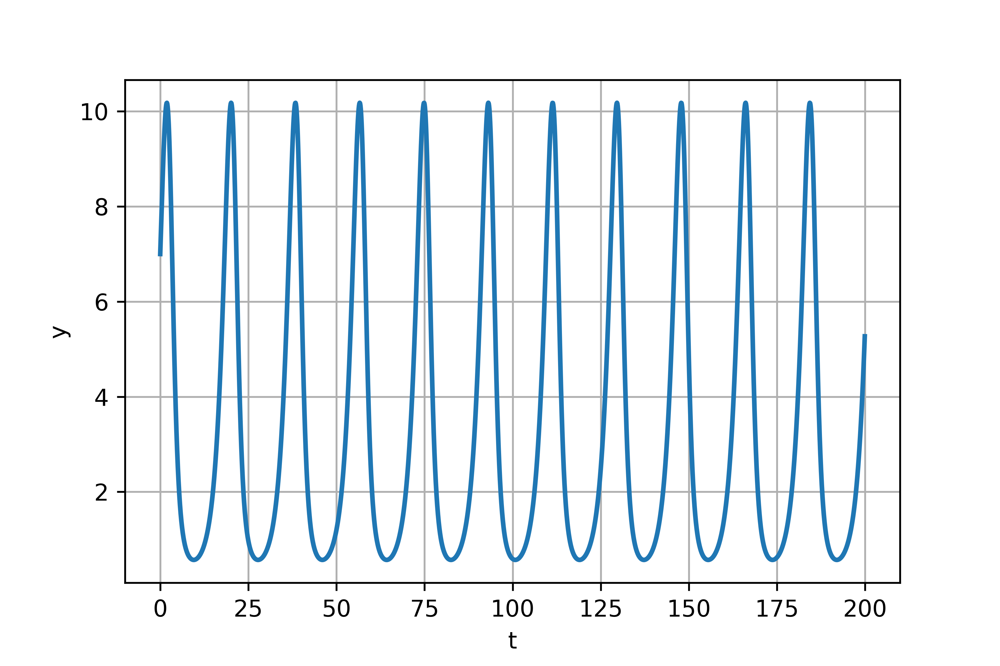
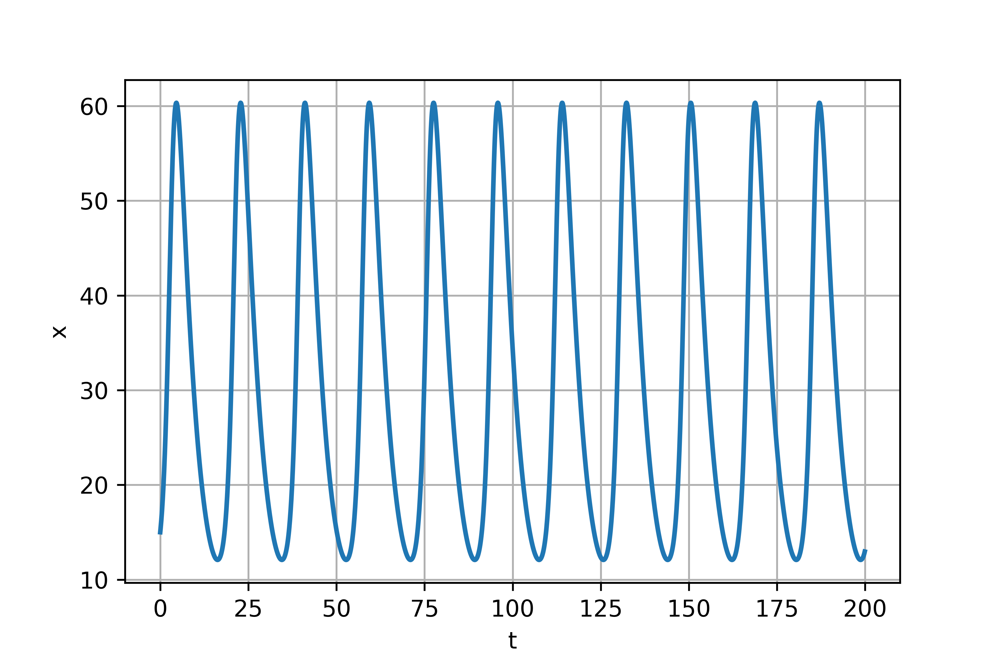
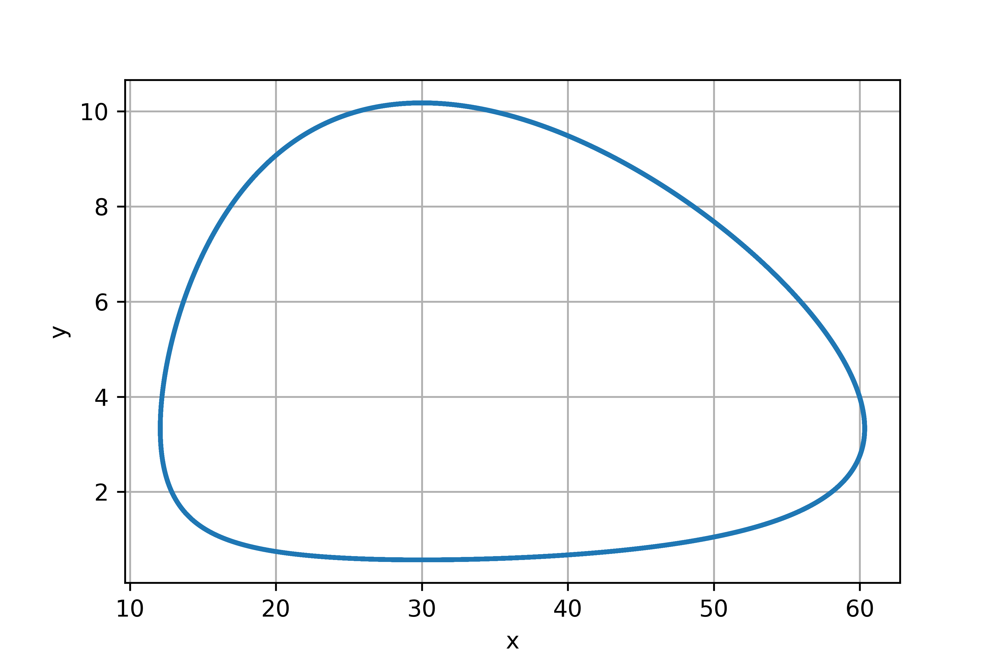

---
# Front matter
lang: ru-RU
title: "Отчет по лабораторной работе №5"
subtitle: "Модель хищник-жертва - вариант 15"
author: "Жиронкин Павел Владимирович НПИбд-01-18"

# Formatting
toc-title: "Содержание"
toc: true # Table of contents
toc_depth: 2
lof: true # List of figures
fontsize: 12pt
linestretch: 1.5
papersize: a4paper
documentclass: scrreprt
polyglossia-lang: russian
polyglossia-otherlangs: english
mainfont: PT Serif
romanfont: PT Serif
sansfont: PT Sans
monofont: PT Mono
mainfontoptions: Ligatures=TeX
romanfontoptions: Ligatures=TeX
sansfontoptions: Ligatures=TeX,Scale=MatchLowercase
monofontoptions: Scale=MatchLowercase
indent: true
pdf-engine: lualatex
header-includes:
  - \linepenalty=10 # the penalty added to the badness of each line within a paragraph (no associated penalty node) Increasing the υalue makes tex try to haυe fewer lines in the paragraph.
  - \interlinepenalty=0 # υalue of the penalty (node) added after each line of a paragraph.
  - \hyphenpenalty=50 # the penalty for line breaking at an automatically inserted hyphen
  - \exhyphenpenalty=50 # the penalty for line breaking at an explicit hyphen
  - \binoppenalty=700 # the penalty for breaking a line at a binary operator
  - \relpenalty=500 # the penalty for breaking a line at a relation
  - \clubpenalty=150 # extra penalty for breaking after first line of a paragraph
  - \widowpenalty=150 # extra penalty for breaking before last line of a paragraph
  - \displaywidowpenalty=50 # extra penalty for breaking before last line before a display math
  - \brokenpenalty=100 # extra penalty for page breaking after a hyphenated line
  - \predisplaypenalty=10000 # penalty for breaking before a display
  - \postdisplaypenalty=0 # penalty for breaking after a display
  - \floatingpenalty = 20000 # penalty for splitting an insertion (can only be split footnote in standard LaTeX)
  - \raggedbottom # or \flushbottom
  - \usepackage{float} # keep figures where there are in the text
  - \floatplacement{figure}{H} # keep figures where there are in the text
---

# Цель работы

Изучить модель хищник-жертва

# Задание

1.	Построить график зависимости $x$ от $y$ и графики функций $x(t)$, $y(t)$
2.	Найти стационарное состояние системы


# Выполнение лабораторной работы

## Теоретические сведения

В данной лабораторной работе рассматривается математическая модель системы «Хищник-жертва». 

Рассмотрим базисные компоненты системы. 
Пусть система имеет $X$ хищников и $Y$ жертв. И пусть для этой системы выполняются следующие предположения: (Модель Лотки-Вольтерра)
1.	Численность популяции жертв и хищников зависят только от времени (модель не учитывает пространственное распределение популяции на занимаемой территории) 
2.	В отсутствии взаимодействия численность видов изменяется по модели Мальтуса, при этом число жертв увеличивается, а число хищников падает 
3.	Естественная смертность жертвы и естественная рождаемость хищника считаются несущественными 
4.	Эффект насыщения численности обеих популяций не учитывается 
5.	Скорость роста численности жертв уменьшается пропорционально численности хищников:

$$
 \begin{cases}
	\frac{dx}{dt} = (-ax(t) + by(t)x(t))
	\\   
	\frac{dy}{dt} = (cy(t) - dy(t)x(t))
 \end{cases}
$$

Параметр $a$ определяет коэффициент смертности хищников, $b$ – коэффициент естественного прироста хищников, $c$ – коэффициент прироста жертв и $d$ – коэффициент смертности жертв

В зависимости от этих параметрах система и будет изменяться. Однако следует выделить одно важное состояние системы, при котором не происходит никаких изменений как со стороны хищников, так и со стороны жертв. Это, так называемое, стационарное состояние системы. При нем, как уже было отмечено, изменение численности популяции равно нулю.
Следовательно, при отсутствии изменений в системе $\frac{dx}{dt} = 0, \frac{dy}{dt} = 0$

Пусть по условию есть хотя бы один хищник и хотя бы одна жертва: $x>0, y>0$
Тогда стационарное состояние системы определяется следующим образом: 
$$
	x_0=\frac{a}{b}, y_0=\frac{c}{d}
$$

## Задача

Для модели «хищник-жертва»:

$$
 \begin{cases}
	\frac{dx}{dt} = (-0.22x(t) + 0.066y(t)x(t))
	\\   
	\frac{dy}{dt} = (0.66y(t) - 0.022y(t)x(t))
 \end{cases}
$$

Постройте график зависимости численности хищников от численности жертв, а также графики изменения численности хищников и численности жертв 
при следующих начальных условиях: $x_0=7, y_0=15$
Найдите стационарное состояние системы


```
import numpy as np
from scipy. integrate import odeint
import matplotlib.pyplot as plt
import math

a = 0.22
b = 0.066
c = 0.66
d = 0.022

y0 = [15, 7]

def syst2(y, t):
    y1, y2 = y
    return [-a*y1 + b*y1*y2, c*y2 - d*y1*y2 ]

t = np.arange( 0, 200, 0.1)
y = odeint(syst2, y0, t)
y11 = y[:,0]
y21 = y[:,1]

fig = plt.figure(facecolor='white')
plt.plot(t, y21, linewidth=2)
plt.ylabel("y")
plt.xlabel("t")
plt.grid(True)
plt.show()
fig.savefig('01.png', dpi = 600)

fig2 = plt.figure(facecolor='white')
plt.plot(t, y11, linewidth=2)
plt.ylabel("x")
plt.xlabel("t")
plt.grid(True)
plt.show()
fig2.savefig('02.png', dpi = 600)

fig3 = plt.figure(facecolor='white')
plt.plot(y11, y21, linewidth=2)
plt.ylabel("y")
plt.xlabel("x")
plt.grid(True)
plt.show()
fig3.savefig('03.png', dpi = 600)

print("Yст = ", a/b)
print("Xст = ", c/d)
```

{ #fig:001 width=70% height=70% }

{ #fig:002 width=70% height=70% }

{ #fig:003 width=70% height=70% }


Стационарное состояние $x_0=30, y_0=3.333$

# Выводы
В ходе выполнения лабораторной работы была изучена модель хищник-жертва и построены графики.