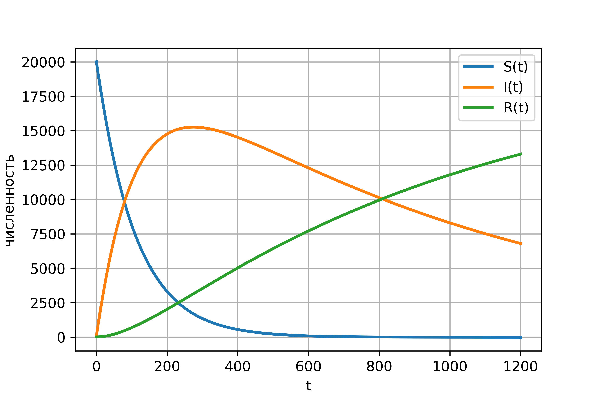

---
# Front matter
lang: ru-RU
title: "Отчет по лабораторной работе №6"
subtitle: "Модель эпидемии - вариант 15"
author: "Жиронкин Павел Владимирович НПИбд-01-18"

# Formatting
toc-title: "Содержание"
toc: true # Table of contents
toc_depth: 2
lof: true # List of figures
fontsize: 12pt
linestretch: 1.5
papersize: a4paper
documentclass: scrreprt
polyglossia-lang: russian
polyglossia-otherlangs: english
mainfont: PT Serif
romanfont: PT Serif
sansfont: PT Sans
monofont: PT Mono
mainfontoptions: Ligatures=TeX
romanfontoptions: Ligatures=TeX
sansfontoptions: Ligatures=TeX,Scale=MatchLowercase
monofontoptions: Scale=MatchLowercase
indent: true
pdf-engine: lualatex
header-includes:
  - \linepenalty=10 # the penalty added to the badness of each line within a paragraph (no associated penalty node) Increasing the υalue makes tex try to haυe fewer lines in the paragraph.
  - \interlinepenalty=0 # υalue of the penalty (node) added after each line of a paragraph.
  - \hyphenpenalty=50 # the penalty for line breaking at an automatically inserted hyphen
  - \exhyphenpenalty=50 # the penalty for line breaking at an explicit hyphen
  - \binoppenalty=700 # the penalty for breaking a line at a binary operator
  - \relpenalty=500 # the penalty for breaking a line at a relation
  - \clubpenalty=150 # extra penalty for breaking after first line of a paragraph
  - \widowpenalty=150 # extra penalty for breaking before last line of a paragraph
  - \displaywidowpenalty=50 # extra penalty for breaking before last line before a display math
  - \brokenpenalty=100 # extra penalty for page breaking after a hyphenated line
  - \predisplaypenalty=10000 # penalty for breaking before a display
  - \postdisplaypenalty=0 # penalty for breaking after a display
  - \floatingpenalty = 20000 # penalty for splitting an insertion (can only be split footnote in standard LaTeX)
  - \raggedbottom # or \flushbottom
  - \usepackage{float} # keep figures where there are in the text
  - \usepackage{amsmath}
  - \floatplacement{figure}{H} # keep figures where there are in the text
---

# Цель работы

Изучить модель эпидемии $SIR$

# Задание

1.	Изучить модель эпидемии
2.	Построить графики изменения числа особей в каждой из трех групп. Рассмотреть, как будет протекать эпидемия в случае: $I(0)\leq I^*$, $I(0)>I^*$


# Выполнение лабораторной работы

## Теоретические сведения

Рассмотрим простейшую модель эпидемии. Предположим, что некая популяция, состоящая из $N$ особей, (считаем, что популяция изолирована) подразделяется на три группы. Первая группа - это восприимчивые к болезни, но пока здоровые особи, обозначим их через $S(t)$. Вторая группа – это число инфицированных особей, которые также при этом являются распространителями инфекции, обозначим их $I(t)$. А третья группа, обозначающаяся через $R(t)$ – это здоровые особи с иммунитетом к болезни. 
До того, как число заболевших не превышает критического значения $I^*$, считаем, что все больные изолированы и не заражают здоровых. Когда $I(t)> I^*$, тогда инфицирование способны заражать восприимчивых к болезни особей. 

Таким образом, скорость изменения числа $S(t)$ меняется по следующему закону:

$$
\frac{dS}{dt}=
 \begin{cases}
	-\alpha S &\text{,если $I(t) > I^*$}
	\\   
	0 &\text{,если $I(t) \leq I^*$}
 \end{cases}
$$

Поскольку каждая восприимчивая к болезни особь, которая, в конце концов, заболевает, сама становится инфекционной, то скорость изменения числа инфекционных особей представляет разность за единицу времени между заразившимися и теми, кто уже болеет и лечится. Т.е.:

$$
\frac{dI}{dt}=
 \begin{cases}
	\alpha S -\beta I &\text{,если $I(t) > I^*$}
	\\   
	-\beta I &\text{,если $I(t) \leq I^*$}
 \end{cases}
$$

А скорость изменения выздоравливающих особей (при этом приобретающие иммунитет к болезни):

$$\frac{dR}{dt} = \beta I$$

Постоянные пропорциональности $\alpha, \beta$ - это коэффициенты заболеваемости и выздоровления соответственно. Для того, чтобы решения соответствующих уравнений определялось однозначно, необходимо задать начальные условия. Считаем, что на начало эпидемии в момент времени $t=0$ нет особей с иммунитетом к болезни $R(0)=0$, а число инфицированных и восприимчивых к болезни особей $I(0)$ и $S(0)$ соответственно. Для анализа картины протекания эпидемии необходимо рассмотреть два случая:  $I(0) \leq I^*$ и  $I(0)>I^*$

## Задача

На одном острове вспыхнула эпидемия. Известно, что из всех проживающих на острове $(N=20100)$ в момент начала эпидемии $(t=0)$ число заболевших людей (являющихся распространителями инфекции) $I(0)=77$, А число здоровых людей с иммунитетом к болезни $R(0)=21$. Таким образом, число людей восприимчивых к болезни, но пока здоровых, в начальный момент времени $S(0)=N-I(0)-R(0)$.
Постройте графики изменения числа особей в каждой из трех групп.
Рассмотрите, как будет протекать эпидемия в случае:
1.	$I(0)\leq I^*$
2.	$I(0)>I^*$

```
import numpy as np
from scipy. integrate import odeint
import matplotlib.pyplot as plt
import math

N = 20100
I0 = 77
R0 = 21
S0 = N-I0-R0

a = 0.009
b = 0.001

x0 = [S0, I0, R0]

def syst(y, t):
    y1, y2, y3 = y
    return [0, -b*y2, b*y2 ]


def syst2(y, t):
    y1, y2, y3 = y
    return [-a*y1, a*y1-b*y2, b*y2 ]

t = np.arange( 0, 1200, 0.05)
y1 = odeint(syst, x0, t)
y1s = y1[:,0]
y1i = y1[:,1]
y1r = y1[:,2]

fig = plt.figure(facecolor='white')
plt.plot(t, y1s, linewidth=2, label='S(t)')
plt.plot(t, y1i, linewidth=2, label='I(t)')
plt.plot(t, y1r, linewidth=2, label='R(t)')
plt.ylabel("численность")
plt.xlabel("t")
plt.grid(True)
plt.legend()
plt.show()
fig.savefig('01.png', dpi = 600)


y2 = odeint(syst2, x0, t)
y2s = y2[:,0]
y2i = y2[:,1]
y2r = y2[:,2]

fig2 = plt.figure(facecolor='white')
plt.plot(t, y2s, linewidth=2, label='S(t)')
plt.plot(t, y2i, linewidth=2, label='I(t)')
plt.plot(t, y2r, linewidth=2, label='R(t)')
plt.ylabel("численность")
plt.xlabel("t")
plt.grid(True)
plt.legend()
plt.show()
fig2.savefig('02.png', dpi = 600)
```

{ #fig:001 width=70% height=70% }

{ #fig:002 width=70% height=70% }


# Выводы
В ходе выполнения лабораторной работы была изучена модель эпидемии и построены графики.